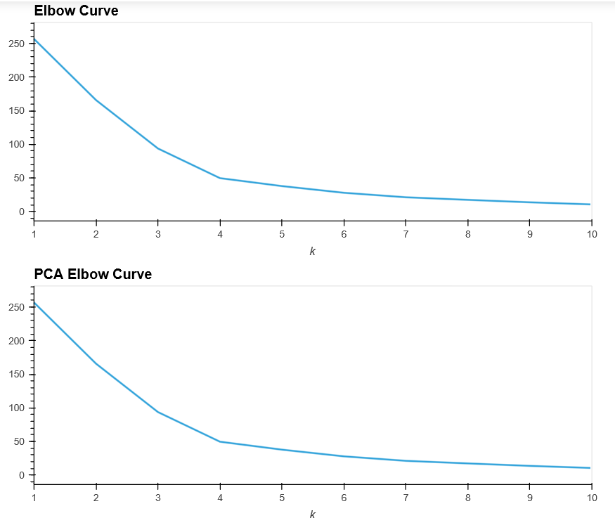
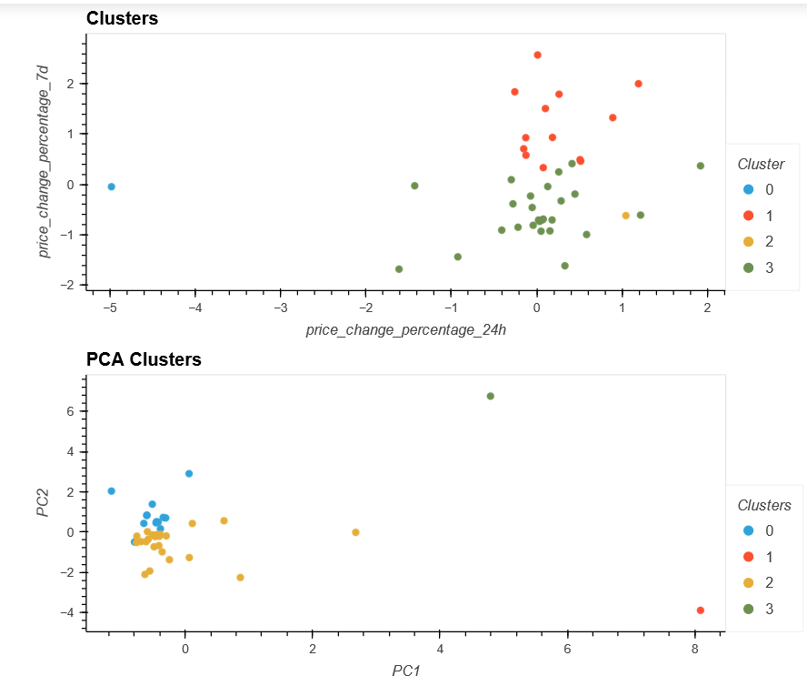

# CryptoClustering
Crypto Clustering Project
In this Python Project, I used Unsupervised Machine Learning to predict whether cryptocurrences are affected by 24-hour or 7-day price changes. Using the KMeans algorithm, I seperated the cryptocoins into categories based on their recent performance.

In order to clean the data, the values were first standardized to the Z-Score. I also performed this analysis with and without Principal Component Analysis. PCA with 3 components describes 89.5% of the original data's variance. 
(
On both datasets, the elbow curves reveal that the optimal value for k is 4. 
(
Using the scatter plots, we can see the clustering for the cryptocurrencies. The PCA allows for better visualization of the data and the outliers. Both ethlend and celsius exist in their own sererate categories. The dimensional reduction here helped to reduce the number of features in the data and optimize value in our analysis.
